# 在线预约系统 产品需求规格说明书

| 文档版本 | 修订日期 | 修订说明 | 作者 |
|---------|---------|---------|------|
| V1.0 | 2026-07-06 | 初稿 | - |

---

## 目录

- [1. 引言](#1-引言)
  - [1.1 项目背景](#11-项目背景)
  - [1.2 项目目标](#12-项目目标)
  - [1.3 项目范围](#13-项目范围)
  - [1.4 术语定义](#14-术语定义)
- [2. 用户需求说明](#2-用户需求说明)
  - [2.1 用户角色定义](#21-用户角色定义)
  - [2.2 用户故事](#22-用户故事)
  - [2.3 业务流程图](#23-业务流程图)
- [3. 需求分析建模](#3-需求分析建模)
  - [3.1 用例图](#31-用例图)
  - [3.2 时序图](#32-时序图)
  - [3.3 数据流图](#33-数据流图)
  - [3.4 类图](#34-类图)
  - [3.5 数据库概念设计（ER 图）](#35-数据库概念设计er-图)
  - [3.6 数据字典](#36-数据字典)
- [4. 非功能性需求](#4-非功能性需求)
  - [4.1 开发环境](#41-开发环境)
  - [4.2 运行环境](#42-运行环境)
  - [4.3 系统依赖项](#43-系统依赖项)
  - [4.4 性能要求](#44-性能要求)
  - [4.5 安全要求](#45-安全要求)
  - [4.6 可扩展性与可维护性](#46-可扩展性与可维护性)
  - [4.7 移动端适配与响应式设计](#47-移动端适配与响应式设计)
- [5. 附录：API 接口概要设计](#5-附录api-接口概要设计)
  - [5.1 认证模块](#51-认证模块)
  - [5.2 用户模块](#52-用户模块)
  - [5.3 服务模块](#53-服务模块)
  - [5.4 预约模块](#54-预约模块)
  - [5.5 评价模块](#55-评价模块)
  - [5.6 通知模块](#56-通知模块)
  - [5.7 推荐与优惠券模块（可选）](#57-推荐与优惠券模块可选)

---

## 1. 引言

### 1.1 项目背景

随着生活服务行业的数字化转型加速，医疗、美容、健身等领域的服务预约场景日益增多。传统电话预约、到店排队等模式存在效率低、信息不对称、管理成本高等痛点。开发一个统一的在线预约系统，能够连接消费者与服务提供者，实现服务信息的透明化展示、预约流程的线上化管理以及评价体系的建立。

### 1.2 项目目标

构建一个基于 **Go + React.js** 技术栈的在线预约系统，实现以下核心目标：

1. **用户端**：提供便捷的服务搜索、在线预约、预约管理、评价反馈等功能
2. **服务端**：为服务提供者提供服务发布、预约管理、数据查看等功能
3. **平台端**：实现用户与服务的有效撮合，提供基础的管理能力

### 1.3 项目范围

#### 核心功能（本次必须实现）

| 模块 | 功能点 | 说明 |
|------|--------|------|
| 用户管理 | 注册、登录、个人信息维护 | JWT 无状态认证 |
| 服务提供者管理 | 商家注册、信息维护、服务发布/下架 | |
| 服务搜索与浏览 | 按分类/关键词搜索、服务详情查看 | |
| 预约管理 | 创建预约、查看预约、取消预约 | 含预约状态流转 |
| 通知提醒 | 预约确认、取消、即将开始等通知 | 站内通知 |
| 评价反馈 | 对已完成预约发表评价和评分 | |
| 移动端适配 | 响应式设计，支持手机端访问 | |

#### 可选功能（本次仅做概要设计，不强制实现）

| 模块 | 功能点 | 说明 |
|------|--------|------|
| 服务推荐 | 基于用户兴趣标签的服务推荐 | |
| 优惠券系统 | 优惠券发放与使用 | |

> 支付网关集成、数据报表与分析等不在本次范围。

### 1.4 术语定义

| 术语 | 英文 | 定义 |
|------|------|------|
| 用户 / 消费者 | Customer / User | 使用平台浏览和预约服务的个人 |
| 服务提供者 / 商家 | Service Provider | 在平台注册并发布服务的企业或个人 |
| 管理员 | Admin | 平台运营管理人员 |
| 预约 | Reservation | 用户选定服务和时间段后创建的预约记录 |
| 服务 | Service | 商家发布的具体的服务项目 |
| JWT | JSON Web Token | 用于前后端分离架构的无状态认证 token |

---

## 2. 用户需求说明

### 2.1 用户角色定义

| 角色 | 英文标识 | 职责说明 |
|------|---------|---------|
| 普通用户 | Customer | 浏览服务、创建和管理预约、发表评价 |
| 服务提供者 | Provider | 发布和管理服务、查看和处理预约、回复评价 |
| 管理员 | Admin | 用户管理、审核服务、系统配置 |

### 2.2 用户故事

#### 2.2.1 普通用户（Customer）

| 编号 | As a | I want to | So that |
|------|------|-----------|---------|
| US-01 | 普通用户 | 注册一个账户 | 能够使用系统的完整功能 |
| US-02 | 普通用户 | 使用邮箱和密码登录系统 | 访问我的个人信息和预约数据 |
| US-03 | 普通用户 | 按服务分类浏览服务列表 | 快速找到感兴趣的服务 |
| US-04 | 普通用户 | 通过关键词搜索服务 | 精准定位特定服务 |
| US-05 | 普通用户 | 查看服务的详细信息（价格、时长、描述等） | 决定是否预约 |
| US-06 | 普通用户 | 查看服务提供者的详细信息 | 了解服务商资质 |
| US-07 | 普通用户 | 选择一个时间段创建预约 | 锁定服务时间 |
| US-08 | 普通用户 | 查看我的预约列表 | 了解所有预约的状态 |
| US-09 | 普通用户 | 取消尚未开始的预约 | 释放时间资源 |
| US-10 | 普通用户 | 对已完成的服务进行评分和文字评价 | 分享消费体验 |
| US-11 | 普通用户 | 查看我的评价历史 | 回顾我发表过的反馈 |
| US-12 | 普通用户 | 收到预约确认和提醒通知 | 不会错过预约时间 |
| US-13 | 普通用户 | 修改我的个人资料 | 更新联系方式等信息 |
| US-14 | 普通用户 | 设置我的兴趣标签 | 获得更精准的服务推荐（可选） |
| US-15 | 普通用户 | 查看系统推荐的服务列表 | 发现可能感兴趣的新服务（可选） |

#### 2.2.2 服务提供者（Provider）

| 编号 | As a | I want to | So that |
|------|------|-----------|---------|
| US-16 | 服务提供者 | 注册成为服务提供者 | 在平台发布服务 |
| US-17 | 服务提供者 | 登录到商家后台 | 管理我的服务和预约 |
| US-18 | 服务提供者 | 发布一个新的服务项目（含名称、价格、描述等） | 向用户展示我的服务 |
| US-19 | 服务提供者 | 编辑已发布的服务信息 | 更新服务内容和价格 |
| US-20 | 服务提供者 | 下架一个服务项目 | 停止接受新的预约 |
| US-21 | 服务提供者 | 查看所有待确认的预约 | 及时响应预约请求 |
| US-22 | 服务提供者 | 确认或拒绝预约请求 | 控制服务安排 |
| US-23 | 服务提供者 | 查看我收到的用户评价 | 了解服务质量反馈 |
| US-24 | 服务提供者 | 修改商家资料 | 更新联系方式、地址等信息 |

#### 2.2.3 管理员（Admin）

| 编号 | As a | I want to | So that |
|------|------|-----------|---------|
| US-25 | 管理员 | 登录管理后台 | 管理系统运行 |
| US-26 | 管理员 | 查看所有用户列表 | 进行用户管理 |
| US-27 | 管理员 | 查看所有服务提供者列表 | 审核商家资质 |
| US-28 | 管理员 | 查看和审核服务信息 | 确保服务内容合规 |

### 2.3 业务流程图

#### 2.3.1 用户注册流程

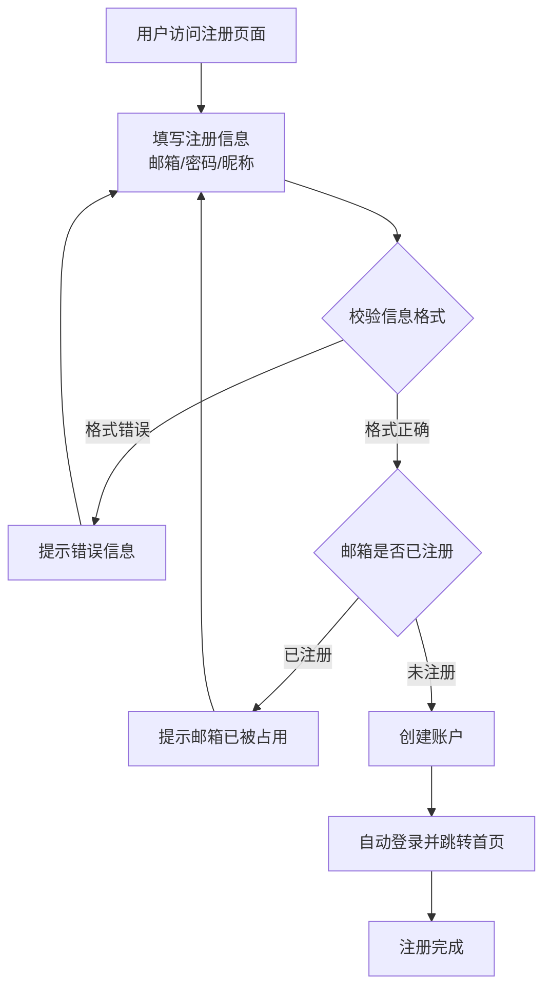
```mermaid
flowchart TD
    A[用户访问注册页面] --> B[填写注册信息<br/>邮箱/密码/昵称]
    B --> C{校验信息格式}
    C -->|格式错误| D[提示错误信息]
    D --> B
    C -->|格式正确| E{邮箱是否已注册}
    E -->|已注册| F[提示邮箱已被占用]
    F --> B
    E -->|未注册| G[创建账户]
    G --> H[自动登录并跳转首页]
    H --> I[注册完成]
```

#### 2.3.2 用户登录流程

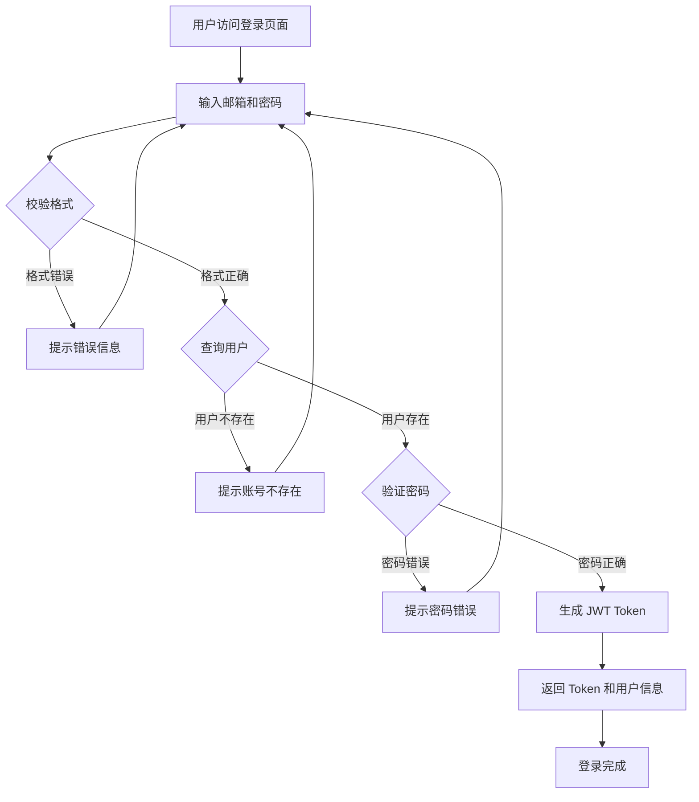
```mermaid
flowchart TD
    A[用户访问登录页面] --> B[输入邮箱和密码]
    B --> C{校验格式}
    C -->|格式错误| D[提示错误信息]
    D --> B
    C -->|格式正确| E{查询用户}
    E -->|用户不存在| F[提示账号不存在]
    F --> B
    E -->|用户存在| G{验证密码}
    G -->|密码错误| H[提示密码错误]
    H --> B
    G -->|密码正确| I[生成 JWT Token]
    I --> J[返回 Token 和用户信息]
    J --> K[登录完成]
```

#### 2.3.3 预约下单流程

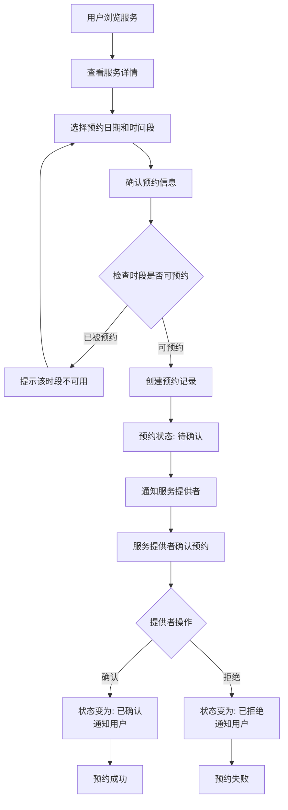
```mermaid
flowchart TD
    A[用户浏览服务] --> B[查看服务详情]
    B --> C[选择预约日期和时间段]
    C --> D[确认预约信息]
    D --> E{检查时段是否可预约}
    E -->|已被预约| F[提示该时段不可用]
    F --> C
    E -->|可预约| G[创建预约记录]
    G --> H[预约状态: 待确认]
    H --> I[通知服务提供者]
    I --> J[服务提供者确认预约]
    J --> K{提供者操作}
    K -->|确认| L[状态变为: 已确认<br/>通知用户]
    K -->|拒绝| M[状态变为: 已拒绝<br/>通知用户]
    L --> N[预约成功]
    M --> O[预约失败]
```

#### 2.3.4 取消预约流程

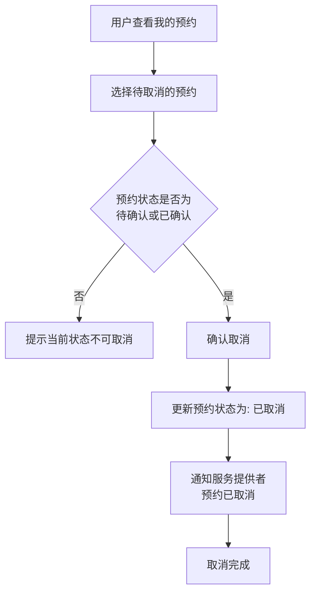
```mermaid
flowchart TD
    A[用户查看我的预约] --> B[选择待取消的预约]
    B --> C{预约状态是否为<br/>待确认或已确认}
    C -->|否| D[提示当前状态不可取消]
    C -->|是| E[确认取消]
    E --> F[更新预约状态为: 已取消]
    F --> G[通知服务提供者<br/>预约已取消]
    G --> H[取消完成]
```

#### 2.3.5 评价反馈流程

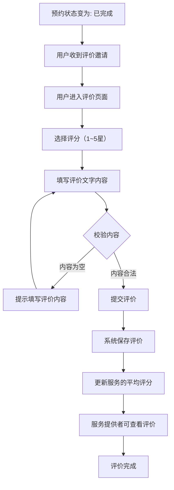
```mermaid
flowchart TD
    A["预约状态变为: 已完成"] --> B["用户收到评价邀请"]
    B --> C["用户进入评价页面"]
    C --> D["选择评分（1~5星）"]
    D --> E["填写评价文字内容"]
    E --> F{"校验内容"}
    F -->|"内容为空"| G["提示填写评价内容"]
    G --> E
    F -->|"内容合法"| H["提交评价"]
    H --> I["系统保存评价"]
    I --> J["更新服务的平均评分"]
    J --> K["服务提供者可查看评价"]
    K --> L["评价完成"]
```

#### 2.3.6 服务提供者发布服务流程

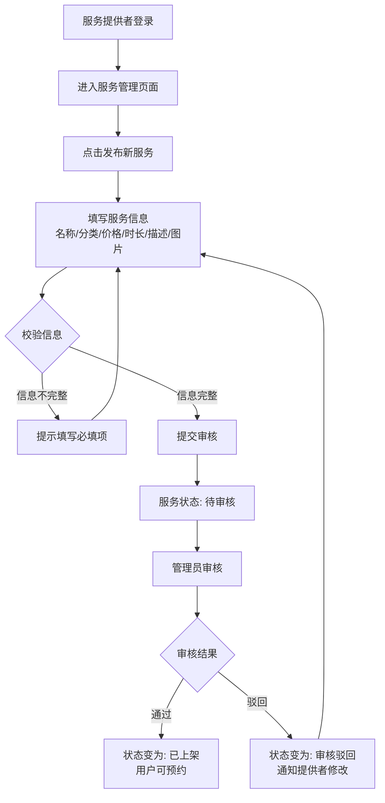
```mermaid
flowchart TD
    A[服务提供者登录] --> B[进入服务管理页面]
    B --> C[点击发布新服务]
    C --> D[填写服务信息<br/>名称/分类/价格/时长/描述/图片]
    D --> E{校验信息}
    E -->|信息不完整| F[提示填写必填项]
    F --> D
    E -->|信息完整| G[提交审核]
    G --> H[服务状态: 待审核]
    H --> I[管理员审核]
    I --> J{审核结果}
    J -->|通过| K[状态变为: 已上架<br/>用户可预约]
    J -->|驳回| L[状态变为: 审核驳回<br/>通知提供者修改]
    L --> D
```

> **注**：为降低 MVP 复杂度，审核流程在初始版本中可简化为发布即上架，后续迭代加入审核机制。本文档保留审核流程作为参考。

---

## 3. 需求分析建模

### 3.1 用例图

#### 3.1.1 总体用例图


```mermaid
graph TB
    subgraph 在线预约系统
        UC1(注册账户)
        UC2(登录系统)
        UC3(浏览服务)
        UC4(搜索服务)
        UC5(查看服务详情)
        UC6(创建预约)
        UC7(查看我的预约)
        UC8(取消预约)
        UC9(发表评价)
        UC10(管理个人信息)
        UC11(发布服务)
        UC12(编辑服务)
        UC13(下架服务)
        UC14(处理预约请求)
        UC15(查看评价)
        UC16(管理商家资料)
        UC17(管理用户)
        UC18(管理服务提供者)
        UC19(审核服务)
        UC20(设置兴趣标签)
        UC21(查看推荐服务)
    end

    Customer((普通用户))
    Provider((服务提供者))
    Admin((管理员))

    Customer --- UC1
    Customer --- UC2
    Customer --- UC3
    Customer --- UC4
    Customer --- UC5
    Customer --- UC6
    Customer --- UC7
    Customer --- UC8
    Customer --- UC9
    Customer --- UC10
    Customer -.- UC20
    Customer -.- UC21

    Provider --- UC1
    Provider --- UC2
    Provider --- UC11
    Provider --- UC12
    Provider --- UC13
    Provider --- UC14
    Provider --- UC15
    Provider --- UC16

    Admin --- UC2
    Admin --- UC17
    Admin --- UC18
    Admin --- UC19
```

> 说明：虚线表示可选功能用例。`UC1` 注册账户和 `UC2` 登录系统为多角色共享用例。

#### 3.1.2 普通用户子用例图

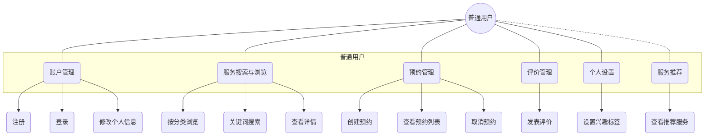
```mermaid
graph TB
    subgraph 普通用户
        UC_Auth(账户管理)
        UC_Search(服务搜索与浏览)
        UC_Booking(预约管理)
        UC_Review(评价管理)
        UC_Rec(服务推荐)
        UC_Profile(个人设置)
    end

    Customer((普通用户))

    Customer --- UC_Auth
    Customer --- UC_Search
    Customer --- UC_Booking
    Customer --- UC_Review
    Customer --- UC_Profile
    Customer -.- UC_Rec

    UC_Auth --> UC1(注册)
    UC_Auth --> UC2(登录)
    UC_Auth --> UC10(修改个人信息)

    UC_Search --> UC3(按分类浏览)
    UC_Search --> UC4(关键词搜索)
    UC_Search --> UC5(查看详情)

    UC_Booking --> UC6(创建预约)
    UC_Booking --> UC7(查看预约列表)
    UC_Booking --> UC8(取消预约)

    UC_Review --> UC9(发表评价)

    UC_Profile --> UC20(设置兴趣标签)
    UC_Rec --> UC21(查看推荐服务)
```

#### 3.1.3 服务提供者子用例图

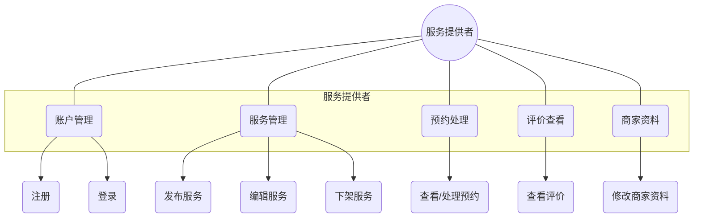
```mermaid
graph TB
    subgraph 服务提供者
        SP_Auth(账户管理)
        SP_Service(服务管理)
        SP_Booking(预约处理)
        SP_Review(评价查看)
        SP_Profile(商家资料)
    end

    Provider((服务提供者))

    Provider --- SP_Auth
    Provider --- SP_Service
    Provider --- SP_Booking
    Provider --- SP_Review
    Provider --- SP_Profile

    SP_Auth --> UC1(注册)
    SP_Auth --> UC2(登录)

    SP_Service --> UC11(发布服务)
    SP_Service --> UC12(编辑服务)
    SP_Service --> UC13(下架服务)

    SP_Booking --> UC14(查看/处理预约)

    SP_Review --> UC15(查看评价)

    SP_Profile --> UC16(修改商家资料)
```

### 3.2 时序图

#### 3.2.1 用户注册时序图

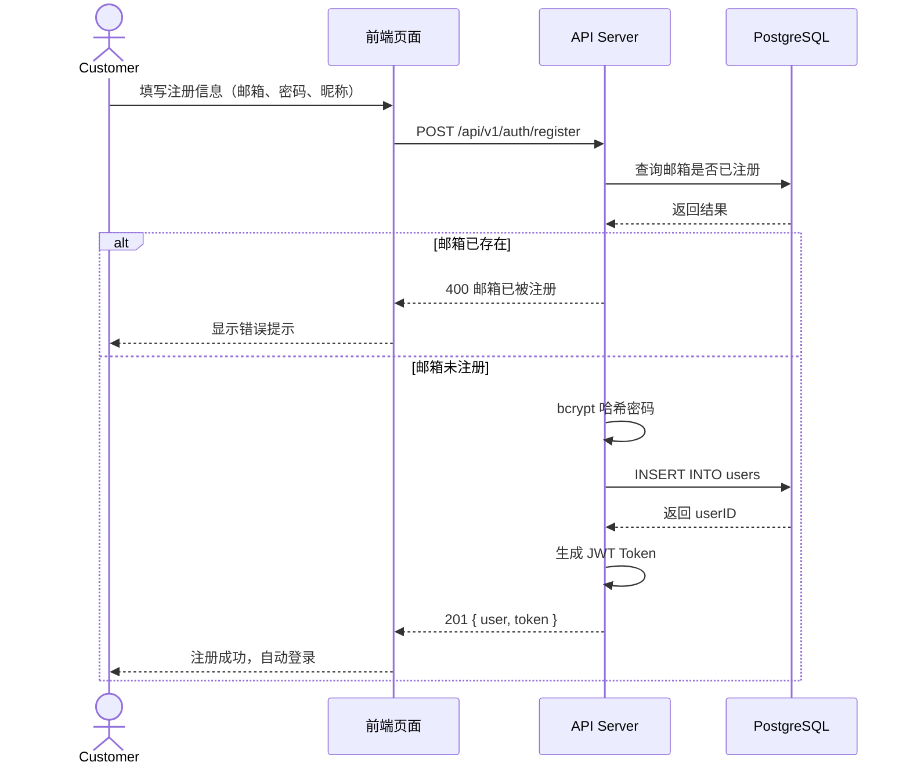
```mermaid
sequenceDiagram
    actor Customer
    participant FE as 前端页面
    participant BE as API Server
    participant DB as PostgreSQL

    Customer->>FE: 填写注册信息（邮箱、密码、昵称）
    FE->>BE: POST /api/v1/auth/register
    BE->>DB: 查询邮箱是否已注册
    DB-->>BE: 返回结果
    alt 邮箱已存在
        BE-->>FE: 400 邮箱已被注册
        FE-->>Customer: 显示错误提示
    else 邮箱未注册
        BE->>BE: bcrypt 哈希密码
        BE->>DB: INSERT INTO users
        DB-->>BE: 返回 userID
        BE->>BE: 生成 JWT Token
        BE-->>FE: 201 { user, token }
        FE-->>Customer: 注册成功，自动登录
    end
```

#### 3.2.2 用户登录时序图（JWT）

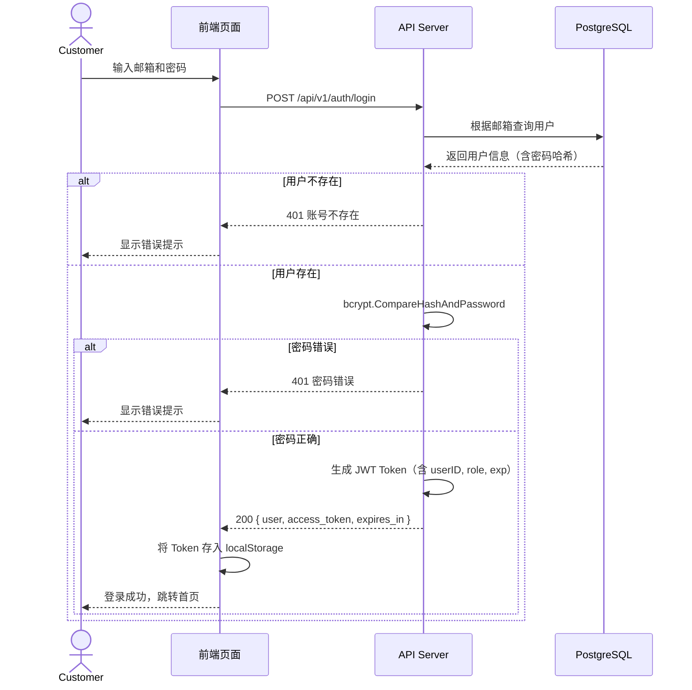
```mermaid
sequenceDiagram
    actor Customer
    participant FE as 前端页面
    participant BE as API Server
    participant DB as PostgreSQL

    Customer->>FE: 输入邮箱和密码
    FE->>BE: POST /api/v1/auth/login
    BE->>DB: 根据邮箱查询用户
    DB-->>BE: 返回用户信息（含密码哈希）
    alt 用户不存在
        BE-->>FE: 401 账号不存在
        FE-->>Customer: 显示错误提示
    else 用户存在
        BE->>BE: bcrypt.CompareHashAndPassword
        alt 密码错误
            BE-->>FE: 401 密码错误
            FE-->>Customer: 显示错误提示
        else 密码正确
            BE->>BE: 生成 JWT Token（含 userID, role, exp）
            BE-->>FE: 200 { user, access_token, expires_in }
            FE->>FE: 将 Token 存入 localStorage
            FE-->>Customer: 登录成功，跳转首页
        end
    end
```

#### 3.2.3 创建预约时序图

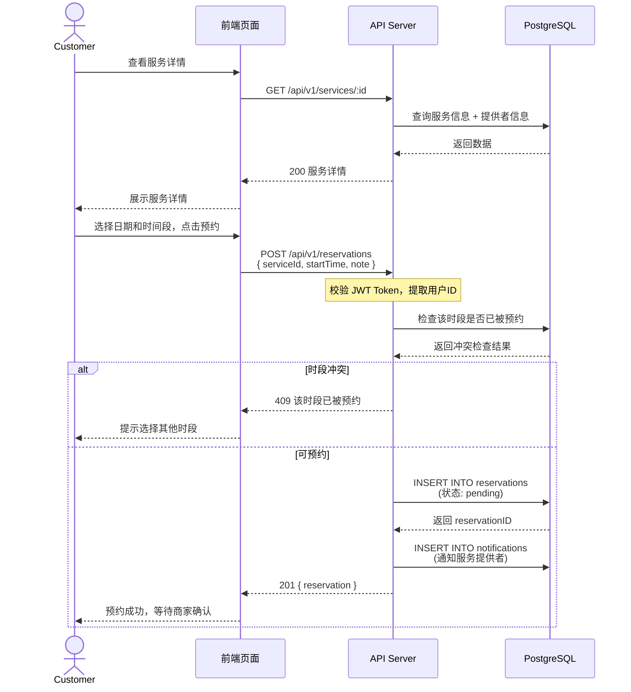
```mermaid
sequenceDiagram
    actor Customer
    participant FE as 前端页面
    participant BE as API Server
    participant DB as PostgreSQL

    Customer->>FE: 查看服务详情
    FE->>BE: GET /api/v1/services/:id
    BE->>DB: 查询服务信息 + 提供者信息
    DB-->>BE: 返回数据
    BE-->>FE: 200 服务详情
    FE-->>Customer: 展示服务详情

    Customer->>FE: 选择日期和时间段，点击预约
    FE->>BE: POST /api/v1/reservations<br/>{ serviceId, startTime, note }
    Note over BE: 校验 JWT Token，提取用户ID

    BE->>DB: 检查该时段是否已被预约
    DB-->>BE: 返回冲突检查结果
    alt 时段冲突
        BE-->>FE: 409 该时段已被预约
        FE-->>Customer: 提示选择其他时段
    else 可预约
        BE->>DB: INSERT INTO reservations<br/>(状态: pending)
        DB-->>BE: 返回 reservationID
        BE->>DB: INSERT INTO notifications<br/>(通知服务提供者)
        BE-->>FE: 201 { reservation }
        FE-->>Customer: 预约成功，等待商家确认
    end
```

#### 3.2.4 取消预约时序图

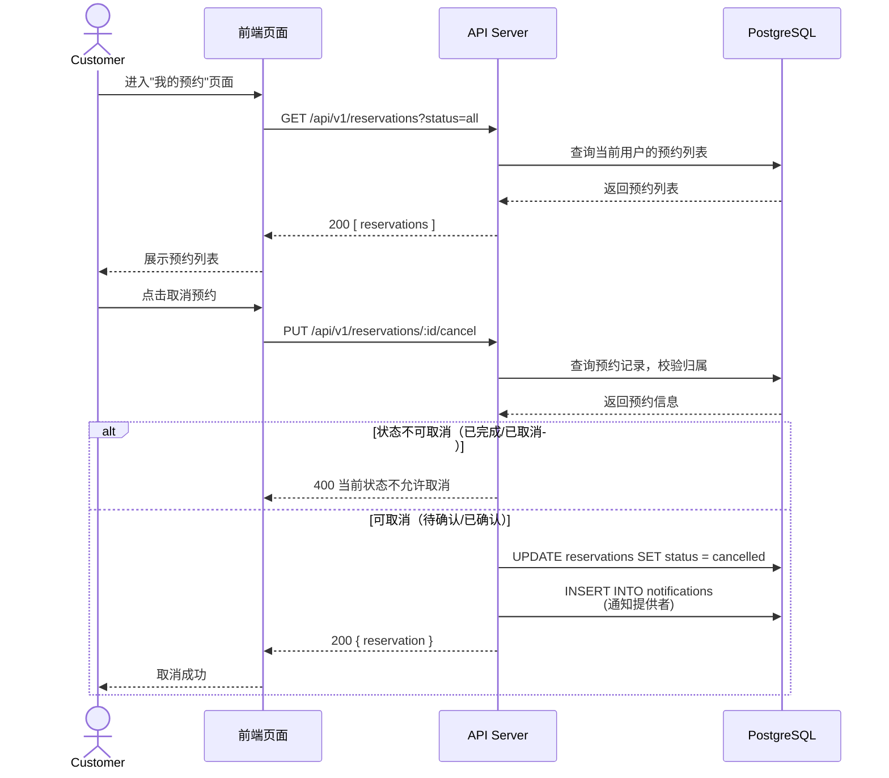
```mermaid
sequenceDiagram
    actor Customer
    participant FE as 前端页面
    participant BE as API Server
    participant DB as PostgreSQL

    Customer->>FE: 进入"我的预约"页面
    FE->>BE: GET /api/v1/reservations?status=all
    BE->>DB: 查询当前用户的预约列表
    DB-->>BE: 返回预约列表
    BE-->>FE: 200 [ reservations ]
    FE-->>Customer: 展示预约列表

    Customer->>FE: 点击取消预约
    FE->>BE: PUT /api/v1/reservations/:id/cancel
    BE->>DB: 查询预约记录，校验归属
    DB-->>BE: 返回预约信息
    alt 状态不可取消（已完成/已取消）
        BE-->>FE: 400 当前状态不允许取消
    else 可取消（待确认/已确认）
        BE->>DB: UPDATE reservations SET status = cancelled
        BE->>DB: INSERT INTO notifications<br/>(通知提供者)
        BE-->>FE: 200 { reservation }
        FE-->>Customer: 取消成功
    end
```

#### 3.2.5 评价反馈时序图

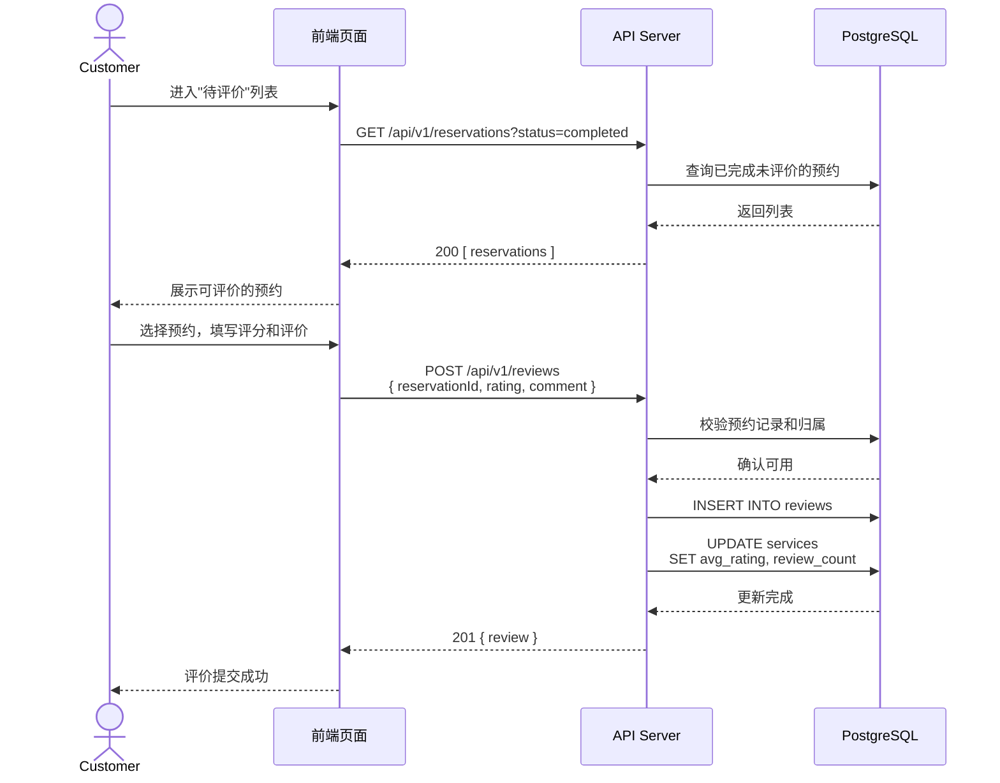
```mermaid
sequenceDiagram
    actor Customer
    participant FE as 前端页面
    participant BE as API Server
    participant DB as PostgreSQL

    Customer->>FE: 进入"待评价"列表
    FE->>BE: GET /api/v1/reservations?status=completed
    BE->>DB: 查询已完成未评价的预约
    DB-->>BE: 返回列表
    BE-->>FE: 200 [ reservations ]
    FE-->>Customer: 展示可评价的预约

    Customer->>FE: 选择预约，填写评分和评价
    FE->>BE: POST /api/v1/reviews<br/>{ reservationId, rating, comment }
    BE->>DB: 校验预约记录和归属
    DB-->>BE: 确认可用
    BE->>DB: INSERT INTO reviews
    BE->>DB: UPDATE services<br/>SET avg_rating, review_count
    DB-->>BE: 更新完成
    BE-->>FE: 201 { review }
    FE-->>Customer: 评价提交成功
```

#### 3.2.6 服务推荐查询时序图（可选）

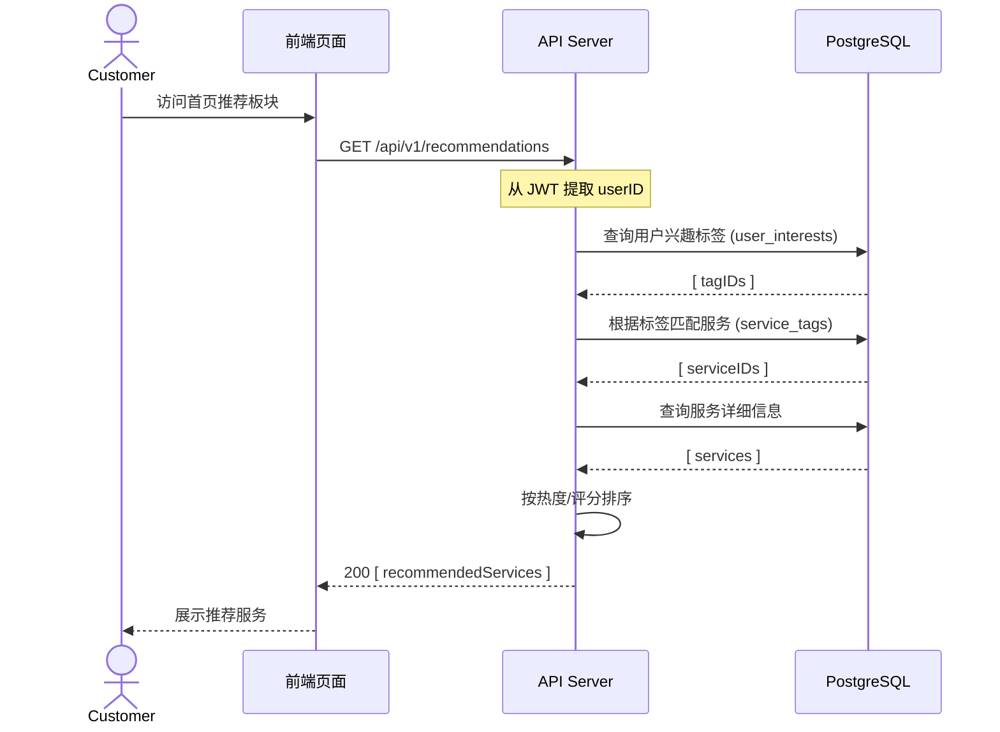
```mermaid
sequenceDiagram
    actor Customer
    participant FE as 前端页面
    participant BE as API Server
    participant DB as PostgreSQL

    Customer->>FE: 访问首页推荐板块
    FE->>BE: GET /api/v1/recommendations
    Note over BE: 从 JWT 提取 userID
    BE->>DB: 查询用户兴趣标签 (user_interests)
    DB-->>BE: [ tagIDs ]
    BE->>DB: 根据标签匹配服务 (service_tags)
    DB-->>BE: [ serviceIDs ]
    BE->>DB: 查询服务详细信息
    DB-->>BE: [ services ]
    BE->>BE: 按热度/评分排序
    BE-->>FE: 200 [ recommendedServices ]
    FE-->>Customer: 展示推荐服务
```

### 3.3 数据流图

#### 3.3.1 上下文图（顶层数据流图）

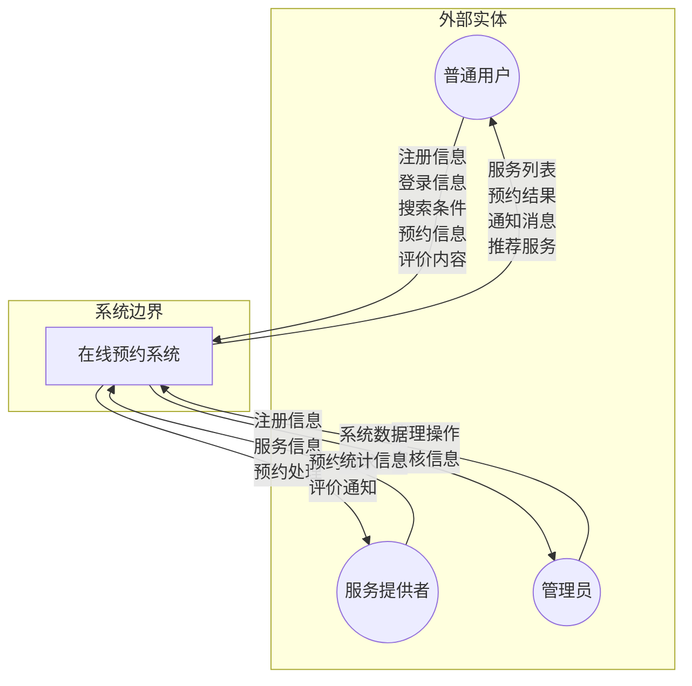
```mermaid
graph TB
    subgraph 外部实体
        Customer((普通用户))
        Provider((服务提供者))
        Admin((管理员))
    end

    subgraph 系统边界
        ORS[在线预约系统]
    end

    Customer -- "注册信息\n登录信息\n搜索条件\n预约信息\n评价内容" --> ORS
    ORS -- "服务列表\n预约结果\n通知消息\n推荐服务" --> Customer

    Provider -- "注册信息\n服务信息\n预约处理" --> ORS
    ORS -- "预约请求\n评价通知" --> Provider

    Admin -- "管理操作\n审核信息" --> ORS
    ORS -- "系统数据\n统计信息" --> Admin
```

#### 3.3.2 0 层数据流图

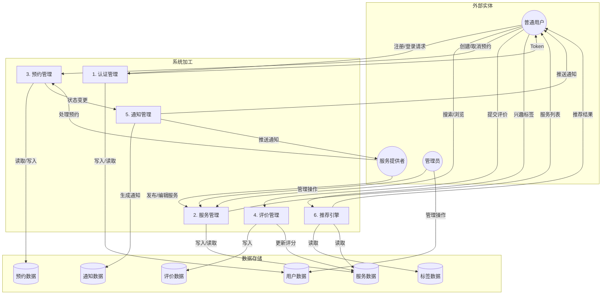
```mermaid
graph TB
    subgraph 外部实体
        Customer((普通用户))
        Provider((服务提供者))
        Admin((管理员))
    end

    subgraph 系统加工
        P1[1. 认证管理]
        P2[2. 服务管理]
        P3[3. 预约管理]
        P4[4. 评价管理]
        P5[5. 通知管理]
        P6[6. 推荐引擎]
    end

    subgraph 数据存储
        D1[(用户数据)]
        D2[(服务数据)]
        D3[(预约数据)]
        D4[(评价数据)]
        D5[(通知数据)]
        D6[(标签数据)]
    end

    Customer -->|注册/登录请求| P1
    P1 -->|写入/读取| D1
    P1 -->|Token| Customer

    Provider -->|发布/编辑服务| P2
    P2 -->|写入/读取| D2
    Customer -->|搜索/浏览| P2
    P2 -->|服务列表| Customer

    Customer -->|创建/取消预约| P3
    Provider -->|处理预约| P3
    P3 -->|读取/写入| D3
    P3 -->|状态变更| P5

    Customer -->|提交评价| P4
    P4 -->|写入| D4
    P4 -->|更新评分| D2

    P5 -->|生成通知| D5
    P5 -->|推送通知| Customer
    P5 -->|推送通知| Provider

    Customer -->|兴趣标签| P6
    P6 -->|读取| D6
    P6 -->|读取| D2
    P6 -->|推荐结果| Customer

    Admin -->|管理操作| P2
    Admin -->|管理操作| D1
```

### 3.4 类图

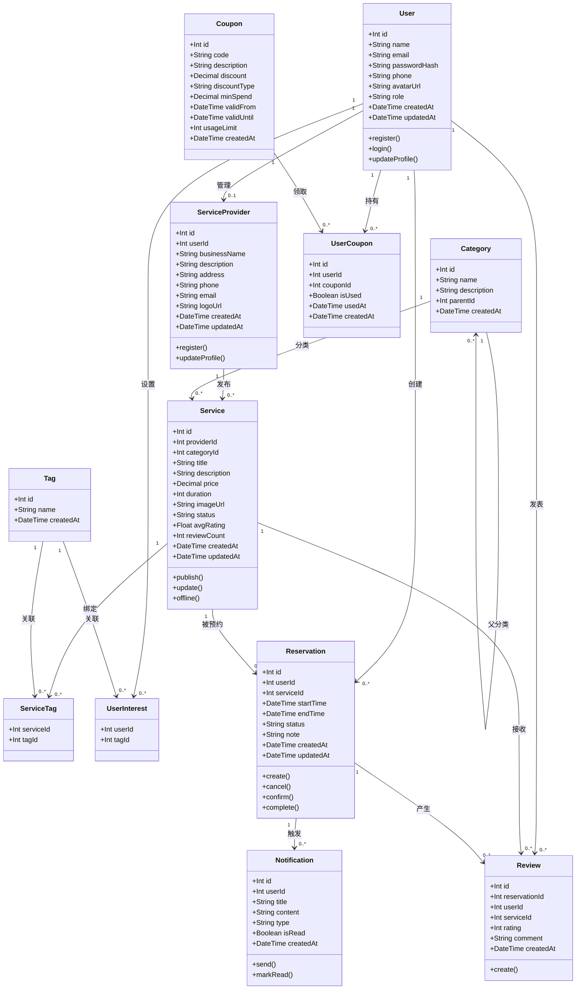
```mermaid
classDiagram
    class User {
        +Int id
        +String name
        +String email
        +String passwordHash
        +String phone
        +String avatarUrl
        +String role
        +DateTime createdAt
        +DateTime updatedAt
        +register()
        +login()
        +updateProfile()
    }

    class ServiceProvider {
        +Int id
        +Int userId
        +String businessName
        +String description
        +String address
        +String phone
        +String email
        +String logoUrl
        +DateTime createdAt
        +DateTime updatedAt
        +register()
        +updateProfile()
    }

    class Category {
        +Int id
        +String name
        +String description
        +Int parentId
        +DateTime createdAt
    }

    class Service {
        +Int id
        +Int providerId
        +Int categoryId
        +String title
        +String description
        +Decimal price
        +Int duration
        +String imageUrl
        +String status
        +Float avgRating
        +Int reviewCount
        +DateTime createdAt
        +DateTime updatedAt
        +publish()
        +update()
        +offline()
    }

    class Tag {
        +Int id
        +String name
        +DateTime createdAt
    }

    class ServiceTag {
        +Int serviceId
        +Int tagId
    }

    class UserInterest {
        +Int userId
        +Int tagId
    }

    class Reservation {
        +Int id
        +Int userId
        +Int serviceId
        +DateTime startTime
        +DateTime endTime
        +String status
        +String note
        +DateTime createdAt
        +DateTime updatedAt
        +create()
        +cancel()
        +confirm()
        +complete()
    }

    class Review {
        +Int id
        +Int reservationId
        +Int userId
        +Int serviceId
        +Int rating
        +String comment
        +DateTime createdAt
        +create()
    }

    class Notification {
        +Int id
        +Int userId
        +String title
        +String content
        +String type
        +Boolean isRead
        +DateTime createdAt
        +send()
        +markRead()
    }

    class Coupon {
        +Int id
        +String code
        +String description
        +Decimal discount
        +String discountType
        +Decimal minSpend
        +DateTime validFrom
        +DateTime validUntil
        +Int usageLimit
        +DateTime createdAt
    }

    class UserCoupon {
        +Int id
        +Int userId
        +Int couponId
        +Boolean isUsed
        +DateTime usedAt
        +DateTime createdAt
    }

    User "1" --> "0..*" Reservation : 创建
    User "1" --> "0..*" Review : 发表
    User "1" --> "0..*" UserInterest : 设置
    User "1" --> "0..*" UserCoupon : 持有
    User "1" --> "0..1" ServiceProvider : 管理

    ServiceProvider "1" --> "0..*" Service : 发布
    Service "1" --> "0..*" ServiceTag : 绑定
    Service "1" --> "0..*" Reservation : 被预约
    Service "1" --> "0..*" Review : 接收

    Category "1" --> "0..*" Service : 分类
    Category "1" --> "0..*" Category : 父分类

    Tag "1" --> "0..*" ServiceTag : 关联
    Tag "1" --> "0..*" UserInterest : 关联

    Reservation "1" --> "0..1" Review : 产生
    Reservation "1" --> "0..*" Notification : 触发

    Coupon "1" --> "0..*" UserCoupon : 领取
```

### 3.5 数据库概念设计（ER 图）

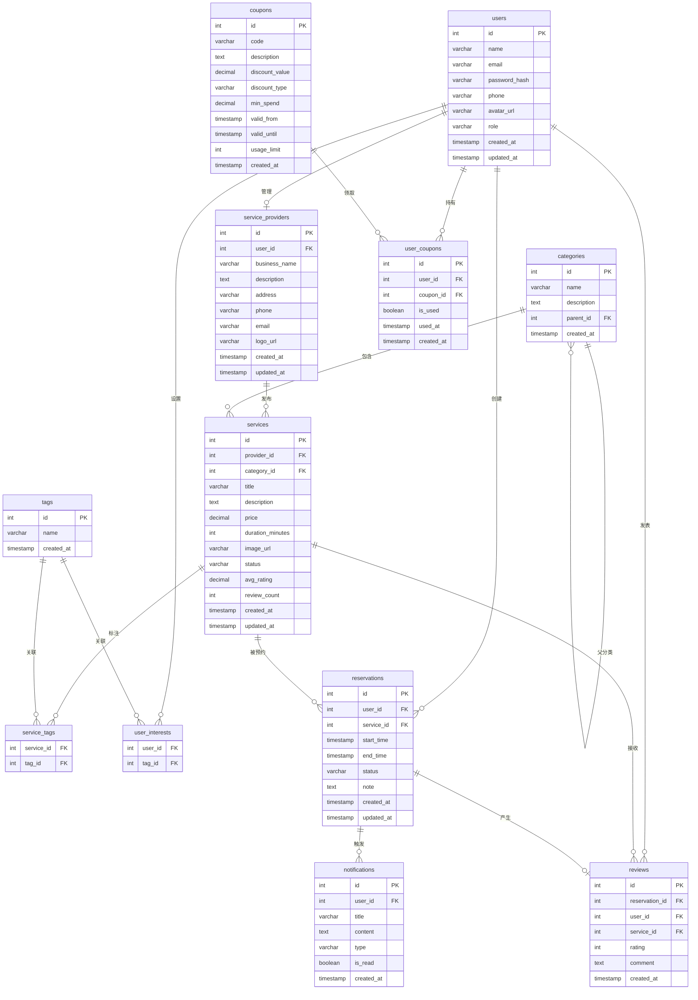
```mermaid
erDiagram
    users {
        int id PK
        varchar name
        varchar email
        varchar password_hash
        varchar phone
        varchar avatar_url
        varchar role
        timestamp created_at
        timestamp updated_at
    }

    service_providers {
        int id PK
        int user_id FK
        varchar business_name
        text description
        varchar address
        varchar phone
        varchar email
        varchar logo_url
        timestamp created_at
        timestamp updated_at
    }

    categories {
        int id PK
        varchar name
        text description
        int parent_id FK
        timestamp created_at
    }

    services {
        int id PK
        int provider_id FK
        int category_id FK
        varchar title
        text description
        decimal price
        int duration_minutes
        varchar image_url
        varchar status
        decimal avg_rating
        int review_count
        timestamp created_at
        timestamp updated_at
    }

    tags {
        int id PK
        varchar name
        timestamp created_at
    }

    service_tags {
        int service_id FK
        int tag_id FK
    }

    user_interests {
        int user_id FK
        int tag_id FK
    }

    reservations {
        int id PK
        int user_id FK
        int service_id FK
        timestamp start_time
        timestamp end_time
        varchar status
        text note
        timestamp created_at
        timestamp updated_at
    }

    reviews {
        int id PK
        int reservation_id FK
        int user_id FK
        int service_id FK
        int rating
        text comment
        timestamp created_at
    }

    notifications {
        int id PK
        int user_id FK
        varchar title
        text content
        varchar type
        boolean is_read
        timestamp created_at
    }

    coupons {
        int id PK
        varchar code
        text description
        decimal discount_value
        varchar discount_type
        decimal min_spend
        timestamp valid_from
        timestamp valid_until
        int usage_limit
        timestamp created_at
    }

    user_coupons {
        int id PK
        int user_id FK
        int coupon_id FK
        boolean is_used
        timestamp used_at
        timestamp created_at
    }

    users ||--o{ reservations : "创建"
    users ||--o{ reviews : "发表"
    users ||--o{ user_interests : "设置"
    users ||--o{ user_coupons : "持有"
    users ||--o| service_providers : "管理"

    service_providers ||--o{ services : "发布"

    categories ||--o{ categories : "父分类"
    categories ||--o{ services : "包含"

    services ||--o{ service_tags : "标注"
    services ||--o{ reservations : "被预约"
    services ||--o{ reviews : "接收"

    tags ||--o{ service_tags : "关联"
    tags ||--o{ user_interests : "关联"

    reservations ||--o| reviews : "产生"
    reservations ||--o{ notifications : "触发"

    coupons ||--o{ user_coupons : "领取"
```

### 3.6 数据字典

#### 3.6.1 用户表 (users)

| 字段名 | 数据类型 | 长度 | 可空 | 默认值 | 约束 | 说明 |
|--------|---------|------|------|--------|------|------|
| id | SERIAL | - | NO | - | PRIMARY KEY | 用户唯一标识 |
| name | VARCHAR | 100 | NO | - | - | 用户昵称 |
| email | VARCHAR | 255 | NO | - | UNIQUE | 登录邮箱 |
| password_hash | VARCHAR | 255 | NO | - | - | bcrypt 哈希密码 |
| phone | VARCHAR | 20 | YES | NULL | - | 手机号 |
| avatar_url | VARCHAR | 500 | YES | NULL | - | 头像 URL |
| role | VARCHAR | 20 | NO | 'customer' | CHECK(role IN ('customer','provider','admin')) | 用户角色 |
| created_at | TIMESTAMPTZ | - | NO | NOW() | - | 创建时间 |
| updated_at | TIMESTAMPTZ | - | NO | NOW() | - | 更新时间 |

#### 3.6.2 服务提供者表 (service_providers)

| 字段名 | 数据类型 | 长度 | 可空 | 默认值 | 约束 | 说明 |
|--------|---------|------|------|--------|------|------|
| id | SERIAL | - | NO | - | PRIMARY KEY | 提供者标识 |
| user_id | INTEGER | - | NO | - | UNIQUE, FK -> users.id | 关联用户ID |
| business_name | VARCHAR | 200 | NO | - | - | 商家名称 |
| description | TEXT | - | YES | NULL | - | 商家简介 |
| address | VARCHAR | 500 | YES | NULL | - | 地址 |
| phone | VARCHAR | 20 | YES | NULL | - | 联系电话 |
| email | VARCHAR | 255 | YES | NULL | - | 联系邮箱 |
| logo_url | VARCHAR | 500 | YES | NULL | - | Logo URL |
| created_at | TIMESTAMPTZ | - | NO | NOW() | - | 创建时间 |
| updated_at | TIMESTAMPTZ | - | NO | NOW() | - | 更新时间 |

#### 3.6.3 服务分类表 (categories)

| 字段名 | 数据类型 | 长度 | 可空 | 默认值 | 约束 | 说明 |
|--------|---------|------|------|--------|------|------|
| id | SERIAL | - | NO | - | PRIMARY KEY | 分类标识 |
| name | VARCHAR | 100 | NO | - | - | 分类名称（如：医疗、美容、健身） |
| description | TEXT | - | YES | NULL | - | 分类描述 |
| parent_id | INTEGER | - | YES | NULL | FK -> categories.id | 父分类ID（支持层级） |
| created_at | TIMESTAMPTZ | - | NO | NOW() | - | 创建时间 |

#### 3.6.4 服务表 (services)

| 字段名 | 数据类型 | 长度 | 可空 | 默认值 | 约束 | 说明 |
|--------|---------|------|------|--------|------|------|
| id | SERIAL | - | NO | - | PRIMARY KEY | 服务标识 |
| provider_id | INTEGER | - | NO | - | FK -> service_providers.id | 所属提供者 |
| category_id | INTEGER | - | NO | - | FK -> categories.id | 所属分类 |
| title | VARCHAR | 200 | NO | - | - | 服务标题 |
| description | TEXT | - | YES | NULL | - | 服务详细描述 |
| price | DECIMAL | 10,2 | NO | - | CHECK(price >= 0) | 价格 |
| duration_minutes | INTEGER | - | NO | - | CHECK(duration > 0) | 服务时长（分钟） |
| image_url | VARCHAR | 500 | YES | NULL | - | 服务图片 |
| status | VARCHAR | 20 | NO | 'active' | CHECK(status IN ('active','inactive','pending','rejected')) | 状态 |
| avg_rating | REAL | - | NO | 0 | CHECK(avg_rating >= 0 AND avg_rating <= 5) | 平均评分 |
| review_count | INTEGER | - | NO | 0 | CHECK(review_count >= 0) | 评价数量 |
| created_at | TIMESTAMPTZ | - | NO | NOW() | - | 创建时间 |
| updated_at | TIMESTAMPTZ | - | NO | NOW() | - | 更新时间 |

#### 3.6.5 标签表 (tags)

| 字段名 | 数据类型 | 长度 | 可空 | 默认值 | 约束 | 说明 |
|--------|---------|------|------|--------|------|------|
| id | SERIAL | - | NO | - | PRIMARY KEY | 标签标识 |
| name | VARCHAR | 50 | NO | - | UNIQUE | 标签名称（如：放松、塑形、美白） |
| created_at | TIMESTAMPTZ | - | NO | NOW() | - | 创建时间 |

#### 3.6.6 服务-标签关联表 (service_tags)

| 字段名 | 数据类型 | 长度 | 可空 | 默认值 | 约束 | 说明 |
|--------|---------|------|------|--------|------|------|
| service_id | INTEGER | - | NO | - | FK -> services.id, 复合主键 | 服务ID |
| tag_id | INTEGER | - | NO | - | FK -> tags.id, 复合主键 | 标签ID |

> 复合主键: (service_id, tag_id)

#### 3.6.7 用户兴趣标签表 (user_interests)

| 字段名 | 数据类型 | 长度 | 可空 | 默认值 | 约束 | 说明 |
|--------|---------|------|------|--------|------|------|
| user_id | INTEGER | - | NO | - | FK -> users.id, 复合主键 | 用户ID |
| tag_id | INTEGER | - | NO | - | FK -> tags.id, 复合主键 | 标签ID |

> 复合主键: (user_id, tag_id)

#### 3.6.8 预约表 (reservations)

| 字段名 | 数据类型 | 长度 | 可空 | 默认值 | 约束 | 说明 |
|--------|---------|------|------|--------|------|------|
| id | SERIAL | - | NO | - | PRIMARY KEY | 预约标识 |
| user_id | INTEGER | - | NO | - | FK -> users.id | 预约用户 |
| service_id | INTEGER | - | NO | - | FK -> services.id | 预约服务 |
| start_time | TIMESTAMPTZ | - | NO | - | - | 预约开始时间 |
| end_time | TIMESTAMPTZ | - | NO | - | - | 预约结束时间（start_time + duration） |
| status | VARCHAR | 20 | NO | 'pending' | CHECK(status IN ('pending','confirmed','completed','cancelled','rejected')) | 预约状态 |
| note | TEXT | - | YES | NULL | - | 用户备注 |
| created_at | TIMESTAMPTZ | - | NO | NOW() | - | 创建时间 |
| updated_at | TIMESTAMPTZ | - | NO | NOW() | - | 更新时间 |

> 索引：UNIQUE (service_id, start_time) — 同一服务同一时段不可重复预约；INDEX (user_id) — 按用户查询预约

#### 3.6.9 评价表 (reviews)

| 字段名 | 数据类型 | 长度 | 可空 | 默认值 | 约束 | 说明 |
|--------|---------|------|------|--------|------|------|
| id | SERIAL | - | NO | - | PRIMARY KEY | 评价标识 |
| reservation_id | INTEGER | - | NO | - | UNIQUE, FK -> reservations.id | 关联预约（一对一） |
| user_id | INTEGER | - | NO | - | FK -> users.id | 评价用户 |
| service_id | INTEGER | - | NO | - | FK -> services.id | 被评价服务 |
| rating | SMALLINT | - | NO | - | CHECK(rating >= 1 AND rating <= 5) | 评分（1-5星） |
| comment | TEXT | - | YES | NULL | - | 评价内容 |
| created_at | TIMESTAMPTZ | - | NO | NOW() | - | 创建时间 |

#### 3.6.10 通知表 (notifications)

| 字段名 | 数据类型 | 长度 | 可空 | 默认值 | 约束 | 说明 |
|--------|---------|------|------|--------|------|------|
| id | SERIAL | - | NO | - | PRIMARY KEY | 通知标识 |
| user_id | INTEGER | - | NO | - | FK -> users.id | 接收用户 |
| title | VARCHAR | 200 | NO | - | - | 通知标题 |
| content | TEXT | - | NO | - | - | 通知内容 |
| type | VARCHAR | 30 | NO | - | CHECK(type IN ('reservation_confirmed','reservation_cancelled','reservation_reminder','review_received','system')) | 通知类型 |
| is_read | BOOLEAN | - | NO | FALSE | - | 是否已读 |
| created_at | TIMESTAMPTZ | - | NO | NOW() | - | 创建时间 |

> 索引：INDEX (user_id, is_read) — 按用户查询未读通知

#### 3.6.11 优惠券表 (coupons) — 可选

| 字段名 | 数据类型 | 长度 | 可空 | 默认值 | 约束 | 说明 |
|--------|---------|------|------|--------|------|------|
| id | SERIAL | - | NO | - | PRIMARY KEY | 优惠券标识 |
| code | VARCHAR | 50 | NO | - | UNIQUE | 优惠码 |
| description | TEXT | - | YES | NULL | - | 优惠说明 |
| discount_value | DECIMAL | 10,2 | NO | - | CHECK(discount_value > 0) | 折扣值 |
| discount_type | VARCHAR | 20 | NO | - | CHECK(discount_type IN ('percentage','fixed')) | 折扣类型（百分比/固定金额） |
| min_spend | DECIMAL | 10,2 | NO | 0 | CHECK(min_spend >= 0) | 最低消费 |
| valid_from | TIMESTAMPTZ | - | NO | - | - | 有效期开始 |
| valid_until | TIMESTAMPTZ | - | NO | - | - | 有效期结束 |
| usage_limit | INTEGER | - | NO | - | CHECK(usage_limit > 0) | 使用次数上限 |
| created_at | TIMESTAMPTZ | - | NO | NOW() | - | 创建时间 |

#### 3.6.12 用户优惠券表 (user_coupons) — 可选

| 字段名 | 数据类型 | 长度 | 可空 | 默认值 | 约束 | 说明 |
|--------|---------|------|------|--------|------|------|
| id | SERIAL | - | NO | - | PRIMARY KEY | 标识 |
| user_id | INTEGER | - | NO | - | FK -> users.id | 用户 |
| coupon_id | INTEGER | - | NO | - | FK -> coupons.id | 优惠券 |
| is_used | BOOLEAN | - | NO | FALSE | - | 是否已使用 |
| used_at | TIMESTAMPTZ | - | YES | NULL | - | 使用时间 |
| created_at | TIMESTAMPTZ | - | NO | NOW() | - | 领取时间 |

> 唯一约束: UNIQUE (user_id, coupon_id) — 同一用户不可重复领取同一优惠券

---

## 4. 非功能性需求

### 4.1 开发环境

| 项目 | 规格 |
|------|------|
| 操作系统 | macOS / Linux (Ubuntu 22.04+) / Windows (WSL2) |
| 后端语言 | Go 1.24+ |
| 前端框架 | React 19 + React Router v8 (Framework Mode) |
| 前端构建工具 | Vite 8 + TypeScript 5.9+ |
| 样式方案 | TailwindCSS v4 |
| 数据库 | PostgreSQL 16+ |
| 版本管理 | Git + GitHub |
| API 测试 | cURL / Postman / Bruno |
| IDE 推荐 | VS Code / GoLand |

### 4.2 运行环境

| 项目 | 说明 |
|------|------|
| 服务器 | Linux 服务器（Ubuntu 22.04+ 或 CentOS 7+） |
| 后端部署 | 编译为二进制文件直接运行，或使用 systemd 管理进程 |
| 前端部署 | 构建为静态文件，使用 Nginx / Caddy 作为 Web 服务器 |
| 数据库 | PostgreSQL 16+，与应用部署在同一内网或同一主机 |
| 反向代理 | Nginx（负责静态资源服务、API 反向代理、SSL 终止） |
| 进程管理 | systemd 或 supervisor（确保后端进程崩溃后自动重启） |
| 资源要求 | 最低 2 核 CPU / 4GB 内存 / 50GB SSD |

#### 部署架构示意

```
用户浏览器
     │
     ▼
  Nginx (80/443)
     │
     ├── /api/* ─────▶ Go API Server (:8080)
     │                        │
     │                        ▼
     │                   PostgreSQL (:5432)
     │
     └── /* ─────▶ 静态资源 (前端构建产物)
```

### 4.3 系统依赖项

#### 4.3.1 后端 (Go)

| 依赖 | 用途 | 说明 |
|------|------|------|
| Go 标准库 `net/http` 或 `chi` | HTTP 路由 | 推荐使用 `chi` 轻量级路由库 |
| `github.com/jackc/pgx/v5` | PostgreSQL 驱动 | 性能优异的纯 Go PG 驱动 |
| `github.com/jmoiron/sqlx` | SQL 扩展 | 简化数据库操作（亦可直接用 pgx） |
| `github.com/golang-jwt/jwt/v5` | JWT 认证 | 生成和验证 JSON Web Token |
| `golang.org/x/crypto/bcrypt` | 密码哈希 | 用户密码安全存储 |
| `github.com/go-playground/validator/v10` | 参数校验 | 请求体字段校验 |
| `github.com/rs/zerolog` | 日志库 | 结构化日志输出 |
| `github.com/golang-migrate/migrate/v4` | 数据库迁移 | 管理数据库 DDL 变更 |

#### 4.3.2 前端 (React)

| 依赖 | 用途 | 说明 |
|------|------|------|
| `react` / `react-dom` | 框架 | 已安装 v19.2 |
| `react-router` | 路由 | 已安装 v8.0 (Framework Mode) |
| `tailwindcss` | CSS 框架 | 已安装 v4 |
| `@tanstack/react-query` | 数据请求 | API 数据获取与缓存管理 |
| `lucide-react` | 图标库 | 轻量级图标组件 |
| `zod` | 数据验证 | 表单数据校验 |
| `react-hook-form` | 表单管理 | 高效的 React 表单处理 |

### 4.4 性能要求

| 指标 | 目标值 |
|------|--------|
| 页面首次加载时间 | ≤ 2秒（3G 网络下） |
| API 响应时间（95分位） | ≤ 200ms |
| API 响应时间（99分位） | ≤ 500ms |
| 并发用户数 | ≥ 1000 同时在线 |
| 数据库查询耗时 | 单表查询 ≤ 50ms，多表关联 ≤ 200ms |
| 系统可用性 | ≥ 99.9%（除计划维护外） |

### 4.5 安全要求

| 要求 | 说明 |
|------|------|
| 密码安全 | 使用 bcrypt 算法哈希存储，不保存明文 |
| 认证方式 | JWT 无状态 Token，设置合理的过期时间（建议 24h） |
| 接口鉴权 | 敏感接口需要携带有效 JWT Token 方可访问 |
| 权限控制 | 基于角色的访问控制（RBAC）：customer / provider / admin |
| SQL 注入防护 | 使用参数化查询（pgx 原生支持） |
| XSS 防护 | React 默认转义输出内容，设置 HTTP-only Cookie |
| CSRF 防护 | 前后端分离架构下，使用 Token 认证天然免疫 |
| 传输安全 | 生产环境强制 HTTPS（由 Nginx 配置 SSL） |
| 数据校验 | 所有用户输入的请求参数都需要服务端校验 |

### 4.6 可扩展性与可维护性

| 要求 | 说明 |
|------|------|
| 模块化 | Go 后端按业务模块分包（auth / service / reservation / review / notification） |
| 数据库迁移 | 所有 Schema 变更通过 migration 脚本管理，可回滚 |
| API 版本化 | URL 路径包含版本号 `/api/v1/...` |
| 日志规范 | 结构化 JSON 日志，包含请求ID、耗时、错误追踪 |
| 错误处理 | 统一的错误响应格式 `{ "error": { "code": "...", "message": "..." } }` |

### 4.7 移动端适配与响应式设计

| 要求 | 说明 |
|------|------|
| 设计原则 | Mobile First 响应式设计 |
| 断点策略 | TailwindCSS 默认断点（sm: 640px / md: 768px / lg: 1024px / xl: 1280px） |
| 触控优化 | 按钮和可点击区域 ≥ 44px，支持手势滑动 |
| 浏览器支持 | Chrome / Firefox / Safari / Edge 最新两个大版本 |
| 测试方式 | 使用 Chrome DevTools 模拟不同设备尺寸 |

---

## 5. 附录：API 接口概要设计

> 所有接口响应格式遵循 `{ "code": 200, "message": "success", "data": {...} }`。

### 5.1 认证模块

| 方法 | 路径 | 说明 | 认证 |
|------|------|------|------|
| POST | `/api/v1/auth/register` | 用户注册 | 否 |
| POST | `/api/v1/auth/login` | 用户登录 | 否 |
| POST | `/api/v1/auth/refresh` | 刷新 Token | 是 |

#### POST /api/v1/auth/register

Request:
```json
{
  "name": "张三",
  "email": "zhangsan@example.com",
  "password": "Abcd1234!",
  "role": "customer"
}
```

Response (201):
```json
{
  "code": 201,
  "message": "注册成功",
  "data": {
    "user": {
      "id": 1,
      "name": "张三",
      "email": "zhangsan@example.com",
      "role": "customer"
    },
    "access_token": "eyJhbGciOiJIUzI1NiIs...",
    "expires_in": 86400
  }
}
```

#### POST /api/v1/auth/login

Request:
```json
{
  "email": "zhangsan@example.com",
  "password": "Abcd1234!"
}
```

Response (200):
```json
{
  "code": 200,
  "message": "登录成功",
  "data": {
    "user": {
      "id": 1,
      "name": "张三",
      "email": "zhangsan@example.com",
      "role": "customer"
    },
    "access_token": "eyJhbGciOiJIUzI1NiIs...",
    "expires_in": 86400
  }
}
```

### 5.2 用户模块

| 方法 | 路径 | 说明 | 认证 |
|------|------|------|------|
| GET | `/api/v1/users/me` | 获取当前用户信息 | 是 |
| PUT | `/api/v1/users/me` | 修改个人信息 | 是 |
| PUT | `/api/v1/users/me/password` | 修改密码 | 是 |
| GET | `/api/v1/users/me/interests` | 获取兴趣标签 | 是 |
| PUT | `/api/v1/users/me/interests` | 设置兴趣标签 | 是 |

### 5.3 服务模块

| 方法 | 路径 | 说明 | 认证 |
|------|------|------|------|
| GET | `/api/v1/categories` | 获取服务分类列表 | 否 |
| GET | `/api/v1/services` | 搜索/浏览服务列表 | 否 |
| GET | `/api/v1/services/:id` | 获取服务详情 | 否 |
| POST | `/api/v1/services` | 发布服务（Provider） | 是 |
| PUT | `/api/v1/services/:id` | 编辑服务（Provider） | 是 |
| PATCH | `/api/v1/services/:id/status` | 修改服务状态（上架/下架） | 是 |
| GET | `/api/v1/providers/:id/services` | 获取某个提供的所有服务 | 否 |
| GET | `/api/v1/recommendations` | 获取推荐服务（可选） | 是 |

#### GET /api/v1/services (搜索服务)

Query Parameters:

| 参数 | 类型 | 必填 | 说明 |
|------|------|------|------|
| keyword | string | 否 | 关键词搜索（匹配标题和描述） |
| category_id | int | 否 | 按分类筛选 |
| provider_id | int | 否 | 按提供者筛选 |
| min_price | decimal | 否 | 最低价格 |
| max_price | decimal | 否 | 最高价格 |
| sort_by | string | 否 | 排序字段（price/rating/created_at），默认 created_at |
| sort_order | string | 否 | asc / desc，默认 desc |
| page | int | 否 | 页码，默认 1 |
| page_size | int | 否 | 每页数量，默认 20，最大 50 |

Response (200):
```json
{
  "code": 200,
  "data": {
    "items": [
      {
        "id": 1,
        "title": "肩颈按摩 60 分钟",
        "provider": {
          "id": 1,
          "business_name": "舒心养生馆"
        },
        "category": {
          "id": 3,
          "name": "健身"
        },
        "price": 199.00,
        "duration_minutes": 60,
        "avg_rating": 4.5,
        "review_count": 128,
        "status": "active"
      }
    ],
    "total": 256,
    "page": 1,
    "page_size": 20
  }
}
```

### 5.4 预约模块

| 方法 | 路径 | 说明 | 认证 |
|------|------|------|------|
| POST | `/api/v1/reservations` | 创建预约 | 是 |
| GET | `/api/v1/reservations` | 获取我的预约列表 | 是 |
| GET | `/api/v1/reservations/:id` | 获取预约详情 | 是 |
| PUT | `/api/v1/reservations/:id/cancel` | 取消预约 | 是 |
| PUT | `/api/v1/provider/reservations/:id/confirm` | 确认预约（Provider） | 是 |
| PUT | `/api/v1/provider/reservations/:id/reject` | 拒绝预约（Provider） | 是 |
| GET | `/api/v1/provider/reservations` | 获取提供者的预约列表 | 是 |

#### POST /api/v1/reservations

Request:
```json
{
  "service_id": 1,
  "start_time": "2026-07-10T14:00:00Z",
  "note": "请准备热水"
}
```

Response (201):
```json
{
  "code": 201,
  "data": {
    "id": 1001,
    "service": {
      "id": 1,
      "title": "肩颈按摩 60 分钟",
      "provider": { "id": 1, "business_name": "舒心养生馆" }
    },
    "start_time": "2026-07-10T14:00:00Z",
    "end_time": "2026-07-10T15:00:00Z",
    "status": "pending",
    "created_at": "2026-07-06T10:30:00Z"
  }
}
```

#### GET /api/v1/reservations

Query Parameters:

| 参数 | 类型 | 必填 | 说明 |
|------|------|------|------|
| status | string | 否 | 筛选状态（pending/confirmed/completed/cancelled/rejected），默认全部 |
| page | int | 否 | 页码，默认 1 |
| page_size | int | 否 | 每页数量，默认 20 |

### 5.5 评价模块

| 方法 | 路径 | 说明 | 认证 |
|------|------|------|------|
| POST | `/api/v1/reviews` | 提交评价 | 是 |
| GET | `/api/v1/services/:id/reviews` | 获取服务评价列表 | 否 |
| GET | `/api/v1/users/me/reviews` | 获取我的评价列表 | 是 |
| GET | `/api/v1/providers/:id/reviews` | 获取提供者的评价列表 | 否 |

#### POST /api/v1/reviews

Request:
```json
{
  "reservation_id": 1001,
  "rating": 5,
  "comment": "服务非常好，师傅技术专业！"
}
```

Response (201):
```json
{
  "code": 201,
  "data": {
    "id": 501,
    "reservation_id": 1001,
    "rating": 5,
    "comment": "服务非常好，师傅技术专业！",
    "created_at": "2026-07-11T09:00:00Z"
  }
}
```

### 5.6 通知模块

| 方法 | 路径 | 说明 | 认证 |
|------|------|------|------|
| GET | `/api/v1/notifications` | 获取通知列表 | 是 |
| GET | `/api/v1/notifications/unread-count` | 获取未读通知数 | 是 |
| PUT | `/api/v1/notifications/:id/read` | 标记通知为已读 | 是 |
| PUT | `/api/v1/notifications/read-all` | 标记全部为已读 | 是 |

### 5.7 推荐与优惠券模块（可选）

| 方法 | 路径 | 说明 | 认证 |
|------|------|------|------|
| GET | `/api/v1/recommendations` | 获取推荐服务 | 是 |
| GET | `/api/v1/coupons` | 获取可用优惠券列表 | 是 |
| POST | `/api/v1/coupons/:id/claim` | 领取优惠券 | 是 |
| GET | `/api/v1/users/me/coupons` | 获取我的优惠券列表 | 是 |

---

> 文档结束
